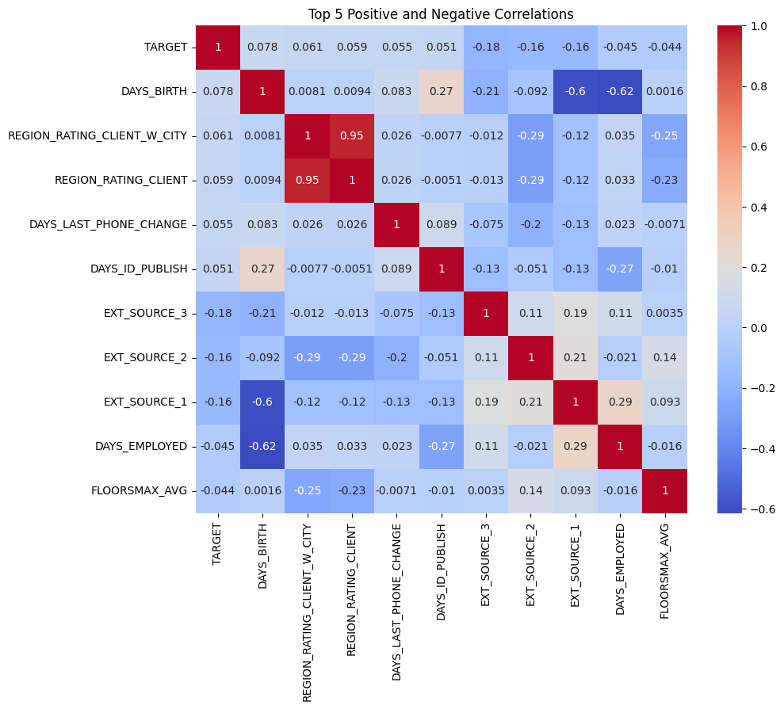

# Portfolio

---

## Data Analysis

### Home Credit Default Risk Forecasting

This is our implementation of our Home Credit Loan Default Risk Forecasting Project for a Kaggle Competition as part of our first capstone course.

[Project 1 Title](/sample_page)

---
[Project 2 Title](/pdf/sample_presentation.pdf)

---
[Project 3 Title](http://example.com/)

---

### Marketing

- [Project 1 Title](http://example.com/)
- [Project 2 Title](http://example.com/)
- [Project 3 Title](http://example.com/)
- [Project 4 Title](http://example.com/)
- [Project 5 Title](http://example.com/)

---

---

Page template forked from <a href="https://github.com/evanca/quick-portfolio">evanca</a>

<!-- Remove above link if you don't want to attibute -->
