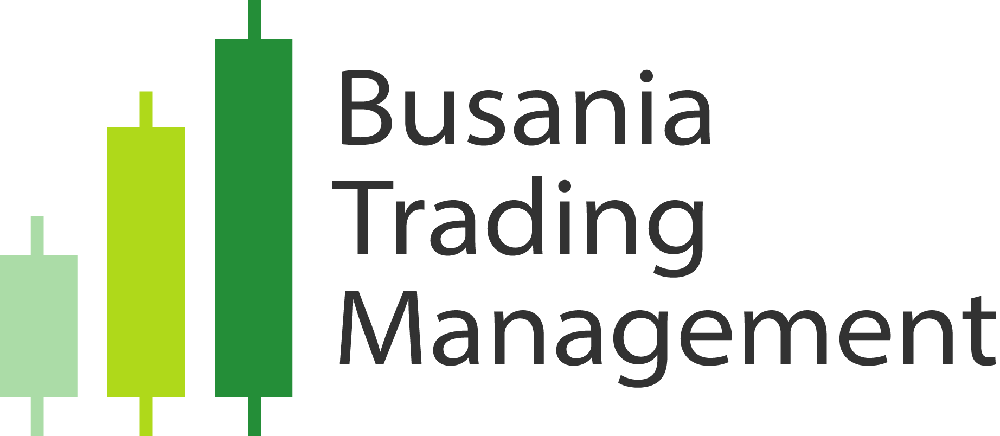

# Portfolio

---

## Data Analysis

### Home Credit Default Risk Forecasting

This represents the implementation of our Home Credit Loan Default Risk Forecasting Project, undertaken as a Kaggle Competition and a pivotal component of our inaugural capstone course. Within the collaborative group, my contributions were focused on identifying optimal indicators to discern the likelihood of default for individuals with minimal or no credit history.

---

### Sales and Brand Analysis Report

This project was developed in response to the diverse challenges and inquiries posed by Sales and Brand Managers seeking strategies to enhance sales for two distinct brands of orange juices in the market. Employing sophisticated analytical methods, the project leveraged both Logistic Regression and Boosted Trees Models to provide comprehensive insights and actionable recommendations.

---

### Hotel Reservation System using Python

This project entails the creation of a sophisticated hotel reservation system, designed to streamline the booking process. Featuring dynamic pricing for various room types, including premium penthouse suites, the system provides real-time availability tracking and efficient scheduling. Users can seamlessly navigate through diverse pricing options and room types, optimizing their hotel booking experience.

---

## Marketing Projects

### Busania Trading Management Brand Creation

This undertaking allowed me to conceptualize the brand identity for a nascent enterprise. Busania Trading Management stands as a venture established with the primary objective of assisting individuals in their trading endeavors and augmenting assets through precise wealth management practices. The methodology employed encompasses the utilization of sophisticated design tools such as Adobe Illustrator and Photoshop.

---

---

© 2024 Daryle Bilog. Powered by Jekyll and the Minimal Theme.

